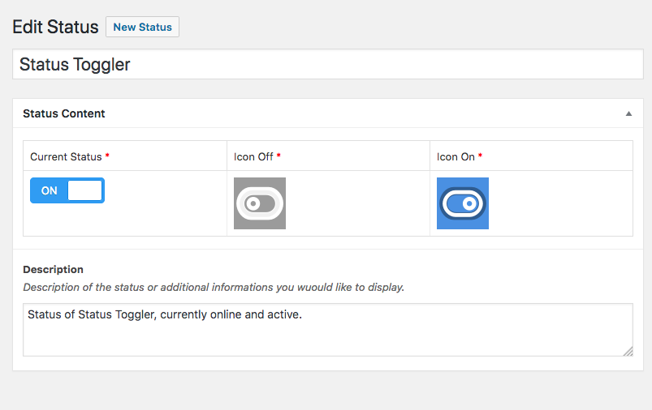

# Status Toggler

Prepared README for the Repo.

WordPress Plugin to display manually configured boolean type status in the front end through Template Hooks.

This Readme is for end user, for Developer please read DEV_README

## Plugin Status

* Current Version is 1.0.0
* Status Toggler Download Link (Compressed)
* Article on How to Use the Plugin

## Licence and Further Development

* This plugin implent GPL 2+ Licence which basically means:
	* You can use the plugin without any obligation
	* You can develop the plugin further more without any obligation

## How to Install and Activate

The installation of the plugin can be done through theese methods:

* Search through Plugins installation interface in WordPress Admin
* Download the plugin file and upload through WordPress Admin
* Clone this git repo in the `plugins` folder of your WordPress Install

### WordPress Admin New Plugin Install

* Log in to WordPress Admin
* Navigate to Plugins > Add New
* Search for this plugin with *Status Toggler* keyword
* Click Install Plugin and Activate

### Install Plugin Manually

* Download the Plugin Compressed file from here
* Log in to WordPress Admin and navigate to Plugins > Add New
* Click Upload File button from the Add New page and select previously downloaded file
* Activate the plugin through Plugins interface in WordPress Admin

## Plugin Deactivation and Uninstallation

## Screenshots

## Using Status Toggler Plugin

## Support Links

* WordPress Plugin Support section